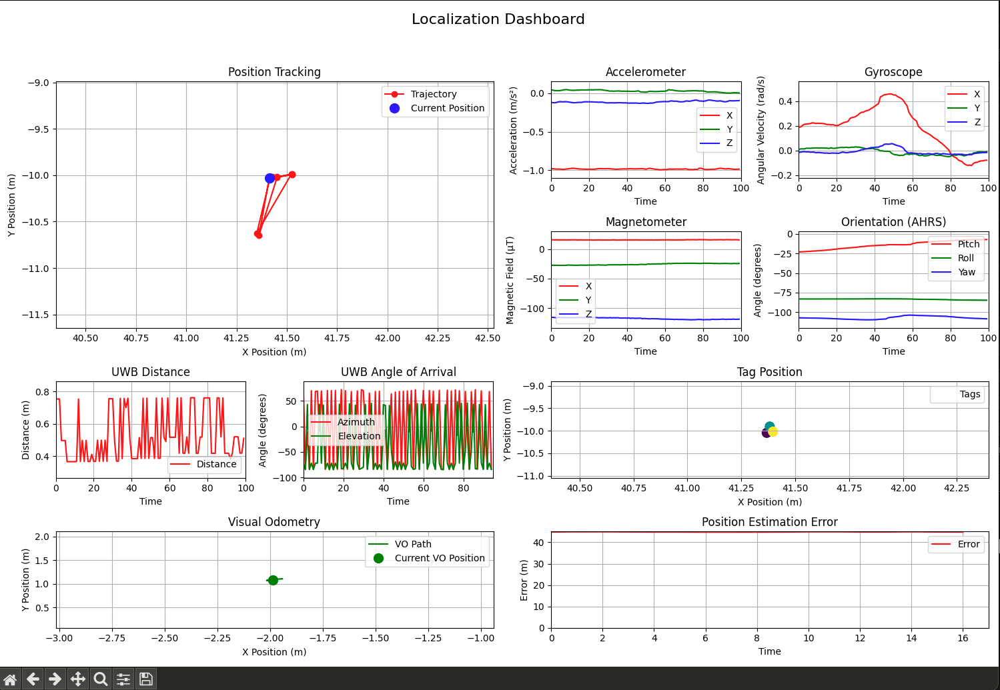

# Example notebooks and scripts for xDR Challenge 2025

This repository contains examples for [xDR Challenge 2025](https://unit.aist.go.jp/rihsa/xDR-Challenge-2025/).

## Setup

### (optional) pyenv virtualenv 
if you use pyenv, we recoomend to make a virtual environment for this project.
```
pyenv install 3.12.4 # recommended but not required
pyenv virtualenv 3.12.4 2025competition
pyenv local 2025competition
```

```
pip install -r requirements.txt
```


### Download and place separately distributed codes/data

#### EvAAL API script
Please copy evaalapi.py from [the EvAAL API webpage](https://evaal.aaloa.org/evaalapi/) and place it to both 02_realtime_sample/ and evaalapi_server/.
(e.g. Make blank file "evaalapi.py" with a text editor and copy contents of evaalapi.py from the above page.)

#### xDR Challenge 2025 dataset
Please download from the privided link and place it into this folder.
If you have not requested the data, please fill in the request form on [the xDR Challenge 2025 webside](https://unit.aist.go.jp/rihsa/xDR-Challenge-2025/).
We will manually check and distribute the dataset link.

After placing, the directory should look like this

```
.
├── 01_parse_data.ipynb
├── 02_realtime_sample
│   ├── 01demo_simple_request.py
│   ├── 02demo_class.py
│   ├── 03demo_location_estimate.py
│   ├── 04demo_data_realtime_plot.py
│   ├── 05demo_get_estimates.py
│   ├── evaalapi.py
│   └── place_evaalapi.py_here
├── 03_map_plot.ipynb
├── README.md
├── evaalapi_server
│   ├── evaalapi.py
│   ├── evaalapi.yaml
│   ├── place_evaalapi.py_here
│   ├── place_trials_directory_here
│   └── trials
│       └── 1.txt
├── figs
│   └── example2-4.png
├── ground_truth
│   └── 1.csv
├── map
│   └── miraikan_5.bmp
└── requirements.txt
```


## Example 1 : contents of the dataset

`01_parse_data.ipynb` overviews contents of the dataset.
You may change data name to explore other data for the first exploratory data analysis.


## Example 2 : real time data reception and submitting results through EvAAL API
The example 2 shows how to use [EvAAL API](https://evaal.aaloa.org/evaalapi/) in this competition.
EvAAL API is a tool to run evaluation of localization system in online or offline restrictions.
IPIN 2025 competitions use this API.

The scripts in example 2 are just for illustration purposes for the use of API.

Please note that the inipos in this track is always 0, 0, 0, which is not true position.

There are following contetnts

* 01demo_simple_request.py : demo script to get data in real time from EvAAL server.
* 02demo_class.py : demo script to store the received data.
* 03demo_location_estimate.py : demo script to estimate location using UWBT and GPOS data.
* 04demo_data_realtime_plot.py : demo script to show data in a dash in realtime.
* 05demo_get_estimation.py : demo script to get and store the posted estimation results into csv file (please run after 03demo_location_estimate.py).

### Launch the EvAAL API server
Open a terminal and run following command.
```bash
cd evaalapi_server
python evaalapi.py
```

```
 * Serving Flask app 'evaalapi'
 * Debug mode: off
WARNING: This is a development server. Do not use it in a production deployment. Use a production WSGI server instead.
 * Running on http://127.0.0.1:5000
Press CTRL+C to quit
```


### Example 2-1
This example shows how to request the EvAAL API server for competition.

Please run following commands. 

```
cd 02_realtime_sample # (if not in 02_realtime_sample)
```


```
python 01demo_simple_request.py onlinedemo/ http://127.0.0.1:5000/evaalapi/
```

The output should be as follows.

```
A demo for the EvAAL API.  Usage is
01demo_simple_request.py [trial] [server]

if omitted, TRIAL defaults to 'onlinedemo' and SERVER to http://127.0.0.1:5000/evaalapi/
# Running %s demo test suite

trial: onlinedemo, server: http://127.0.0.1:5000/evaalapi/

==>  GET /reload --> 200
0.000,-1.000,3.000,15.000,0.000,0.000,0.000,0;0;1


==>  GET /state --> 200
0.000,-1.000,3.000,15.000,0.000,0.000,0.000,0;0;1

{'trialts': 0.0, 'rem': -1.0, 'V': 3.0, 'S': 15.0, 'p': 0.0, 'h': 0.0, 'pts': 0.0, 'pos': '0;0;1'}

==>  GET /nextdata?horizon=0.5 --> 200
ACCE;0.001;0.001;-0.97885;0.04494;-0.13057;0
MAGN;0.002;0.002;15.71196;-27.21548;-116.24034;0
   ... ___295 lines omitted___ ...   
ACCE;0.498;0.498;-0.98723;0.04948;-0.12428;0
AHRS;0.498;0.498;-22.495;-82.104;-105.993;0.60293;0.27022;0.66776;0

....


```


### Example 2-2
This example shows an example to store the received data.


```
python 02demo_class.py onlinedemo/ http://127.0.0.1:5000/evaalapi/
```

The output should be as follows.

```
A demo for the EvAAL API.  Usage is
            02demo_class.py [trial] [server]

            if omitted, TRIAL defaults to 'onlinedemo' and SERVER to http://127.0.0.1:5000/evaalapi/

==>  GET /reload --> 200
0.000,-1.000,3.000,15.000,0.000,0.000,0.000,0;0;1


==>  GET /state --> 200
0.000,-1.000,3.000,15.000,0.000,0.000,0.000,0;0;1

{'trialts': 0.0, 'rem': -1.0, 'V': 3.0, 'S': 15.0, 'p': 0.0, 'h': 0.0, 'pts': 0.0, 'pos': '0;0;1'}

==>  GET /nextdata?horizon=0.5 --> 200
ACCE;0.001;0.001;-0.97885;0.04494;-0.13057;0
MAGN;0.002;0.002;15.71196;-27.21548;-116.24034;0
   ... ___295 lines omitted___ ...   
ACCE;0.498;0.498;-0.98723;0.04948;-0.12428;0
AHRS;0.498;0.498;-22.495;-82.104;-105.993;0.60293;0.27022;0.66776;0

---
(0, 0, 0)
Stored data 
acce: [{'app_timestamp': 0.001, 'sensor_timestamp': 0.001, 'acc_x': -0.97885, 'acc_y': 0.04494, 'acc_z': -0.13057, 'accuracy': 0.0}, {'app_timestamp': 0.011, 'sensor_timestamp': 0.011, 'acc_x': -0.97975, 'acc_y': 0.04704, 'acc_z': -0.12871, 'accuracy': 0.0}, {'app_timestamp': 0.021, 'sensor_timestamp': 0.021, 'acc_x': -0.97972, 'acc_y': 0.04941, 'acc_z': -0.12608, 'accuracy': 0.0}, {'app_timestamp': 0.031, 'sensor_timestamp': 0.031, 'acc_x': -0.97939, 'acc_y': 0.05336, 'acc_z': -0.12331, 'accuracy': 0.0},  

....

```


### Example 2-3
This example show to post the estimation result as well as a very simple localization method.

```
python 03demo_location_estimate.py onlinedemo/ http://127.0.0.1:5000/evaalapi/
```

The output should be as follows.

```
A demo for the EvAAL API.  Usage is
                03demo_location_estimate.py [trial] [server]

                if omitted, TRIAL defaults to 'onlinedemo' and SERVER to http://127.0.0.1:5000/evaalapi/

==>  GET /reload --> 200
0.000,-1.000,3.000,15.000,0.000,0.000,0.000,0;0;1


==>  GET /state --> 200
0.000,-1.000,3.000,15.000,0.000,0.000,0.000,0;0;1

{'trialts': 0.0, 'rem': -1.0, 'V': 3.0, 'S': 15.0, 'p': 0.0, 'h': 0.0, 'pts': 0.0, 'pos': '0;0;1'}

==>  GET /nextdata?horizon=0.5 --> 200
ACCE;0.001;0.001;-0.97885;0.04494;-0.13057;0
MAGN;0.002;0.002;15.71196;-27.21548;-116.24034;0
   ... ___295 lines omitted___ ...   
ACCE;0.498;0.498;-0.98723;0.04948;-0.12428;0
AHRS;0.498;0.498;-22.495;-82.104;-105.993;0.60293;0.27022;0.66776;0

3583WAA
[ 41.368 -10.047   0.935] [ 0.36403    -0.93102    -0.02598     0.00299304]
---
(41.4156966544774, -10.03253876937044, 0)

==>  GET /state --> 200
0.501,15.995,3.000,15.000,1748502880.521,0.500,0.001,0;0;1

{'trialts': 0.501, 'rem': 15.995, 'V': 3.0, 'S': 15.0, 'p': 1748502880.521, 'h': 0.5, 'pts': 0.001, 'pos': '0;0;1'}

==>  GET /nextdata?position=41.4,-10.0,0.0 --> 200
GYRO;0.503;0.503;0.02522;0.01678;-0.00582;0
MAGN;0.507;0.507;15.55319;-26.95827;-116.27066;0
   ... ___312 lines omitted___ ...   
ACCE;0.995;0.995;-0.98386;0.04575;-0.13199;0
GYRO;1.000;1.000;0.00586;0.01454;-0.01265;0

3637RLJ
[ 41.397 -10.02    0.935] [-0.93102    -0.36403     0.00163     0.02610099]
```

### Example 2-4
This example shows how to plot data as a dashboard. Just for illustration.

```
 python 04demo_data_realtime_plot.py onlinedemo/ http://127.0.0.1:5000/evaalapi/
```

The output should be as follows



### Example 2-5
This example shows how to get and store the estimation results which are posted to the server.
As it gets results from the server, you should post data (e.g. 03_demo_location_estimate.py) before running this script.

```
mkdir output
python 05demo_get_estimates.py onlinedemo/ http://127.0.0.1:5000/evaalapi/ output/1_est.csv
```

After running the script, you will have `output/1_est.csv`, which contains estimation results got from the server.

## Example 3
`03_map_plot.ipynb` shows how to plot the location data in the given map.
As this notebook plots estimation results, you should run example 2-5 before running this notebook.
Please see the notebook for more information.
